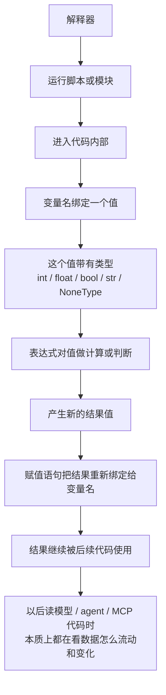

# Day 003 流程图

1. 变量是名字，用来绑定值。
2. 基本类型说明值是什么类型，比如 int、float、bool、str、NoneType。
3. 表达式会计算并产生一个结果值。
4. 赋值语句把某个值或表达式结果绑定给变量名。
5. 解释器、脚本、模块关注“代码怎么被运行和组织”；
   变量、基本类型、表达式关注“代码内部的数据怎么存在和计算”。
6. 以后读模型、agent、MCP 代码，本质上还是在看：数据是什么，怎么变，流向哪里。
