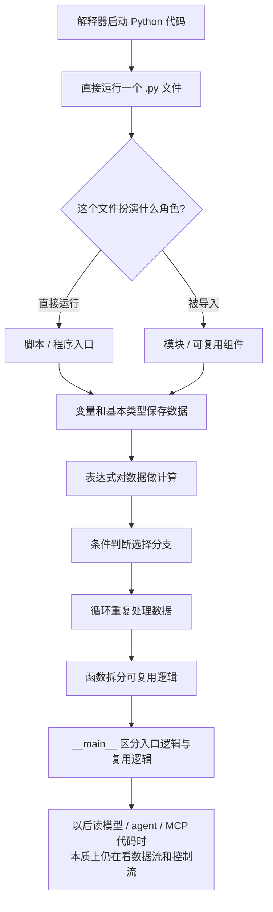

# Day 006 - Python 代码长什么样

## 一句话版本

Python 代码从外到内看，是解释器运行一个脚本或模块；进入代码内部后，用变量和表达式表示数据，用条件和循环组织控制流，用函数拆分逻辑，并用 `if __name__ == "__main__":` 区分入口逻辑和可复用逻辑。

## 这一天真正整合出的结论

如果已经有其他语言基础，这一周学到的大部分内容其实是通用编程概念在 Python 里的表达方式，而不是完全陌生的新知识。

- 解释器，对应“程序怎么被执行”
- 脚本和模块，对应“代码怎么被组织和复用”
- 变量、基本类型、表达式，对应“数据怎么存在和变化”
- 条件和循环，对应“控制流怎么推进”
- 函数入口，对应“程序从哪里开始、哪些逻辑应该被复用”

所以这周更像是在建立一层 Python 视角下的程序心智模型。以后去读模型、agent、MCP 或开源项目代码，本质上仍然是在看这些通用机制如何协作。

## 结构化笔记

### 1. 解释器

- 定义：解释器是运行 Python 代码的执行环境。
- 作用：它负责把 `.py` 文件里的代码按顺序解释并执行。
- 上下游关系：上游是“我启动了一个 Python 进程”；下游是“某个脚本或模块开始运行”。
- 常见误区：现在阶段不需要把注意力放在过细的底层实现上，重点先放在“代码如何被运行起来”这件事。

### 2. 脚本和模块

- 定义：脚本和模块都可以是 `.py` 文件，差别在于它是被直接运行，还是被别的代码导入。
- 作用：脚本更像程序入口，模块更像可复用组件。
- 上下游关系：解释器先运行一个文件；这个文件既可能自己作为入口，也可能导入其他模块来组织更大的程序。
- 常见误区：脚本和模块不是两种完全不同的文件类型，而是同一类文件在不同使用方式下的角色。

### 3. 变量、基本类型、表达式

- 定义：变量是名字，基本类型描述值的形态，表达式负责计算并产生结果。
- 作用：它们构成代码内部的数据层，让程序能保存状态、传递值、生成新值。
- 上下游关系：脚本或模块进入具体逻辑后，就需要变量来存值、表达式来计算，之后这些结果再被条件、循环和函数继续使用。
- 常见误区：变量更接近“名字绑定到某个值”，而不是机械地把它理解成固定容器；表达式的重点是“会产出值”。

### 4. 条件和循环

- 定义：条件语句决定分支，循环语句决定重复。
- 作用：它们构成控制流，让程序根据状态选择路径，或对一批数据持续处理。
- 上下游关系：变量和表达式先准备出值，条件根据这些值判断走哪条分支，循环根据这些值决定是否继续处理。
- 常见误区：
  - `truth value` 不只是 `True` 和 `False`，空字符串、空列表、`None`、`0` 这类值也会在条件判断中表现为假。
  - Python 的 `for` 更像“遍历一个可迭代对象”，不是传统语言里那种强调手动维护计数器的写法。

### 5. 函数和入口逻辑

- 定义：函数用来封装可复用逻辑；入口逻辑决定程序启动后先执行什么。
- 作用：函数负责“这件事怎么做”，入口负责“程序从哪里开始做”。
- 上下游关系：脚本作为入口时可以调用多个函数；模块被导入时则主要提供函数、类、常量等可复用能力。
- 常见误区：`if __name__ == "__main__":` 不是一个新的语法结构，而是利用模块名约定来区分“直接运行”和“被导入”两种场景。

## 一个现在很明确的体会

如果已经学过其他编程语言，那么 Python 入门阶段并不是真的“从 0 开始理解什么是变量、循环、函数”，而是在完成两件事：

1. 把已有的通用编程概念映射到 Python 的表达方式上。
2. 识别 Python 自己更偏好的风格，比如遍历式 `for`、更明显的模块组织方式、用 `__main__` 管理入口。

也就是说，这周的学习价值不在于“第一次知道这些概念存在”，而在于“建立 Python 版本的读码感觉”。

## 和模型工程主线的关系

以后不管是自己做小模型，还是去接 agent、MCP、工具调用、推理服务，都会反复看到这些东西：

- 模块怎么拆，决定系统边界清不清楚
- 变量和表达式怎么流动，决定数据有没有被正确处理
- 条件和循环怎么写，决定逻辑是否正确、是否容易出 bug
- 入口逻辑怎么设计，决定程序是否容易测试、复用和部署

所以这周虽然基础，但它其实是在为后面读复杂工程代码打底。

## 目前还没有完全吃透的问题

1. `truth value` 在更复杂对象上的判断细节，后面还需要在真实代码里继续看。
2. Python 的 `for` 背后为什么天然围绕“可迭代对象”组织，而不是传统计数器风格。
3. 脚本、模块、包、导入路径、`__main__` 在稍大一点项目中的协作方式。

## 给下一个 AI 的交接

- 这一周的核心概念已经可以用自己的话讲出来。
- 用户已经明显感受到“很多概念是跨语言通用的”，说明后续不需要再把过多精力花在最基础的程序结构上。
- 后面更值得强调的是 Python 的惯用风格、工程组织方式，以及这些概念在真实项目中的具体落点。
- Day 006 可以视为已完成，可进入 Day 007 的复盘与进度更新。

## Week 01 结构图

