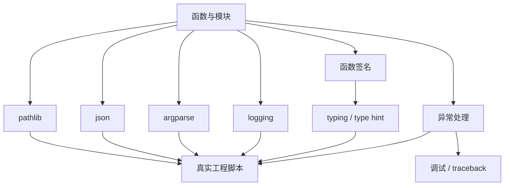

# Day 008 - Week 02 学习地图

## 这周在整条路线里的位置

Week 02 还处在阶段 1 的基础层，但重点已经从“Python 程序长什么样”转向“一个真实 Python 工程如何被组织、调试和维护”。

如果说 Week 01 解决的是：

- 代码怎么运行
- 数据怎么流动
- 控制流怎么推进

那么 Week 02 要解决的是：

- 函数和模块怎样写得更清楚
- 程序出错时怎样定位和处理
- 文件路径、配置、日志、命令行参数怎样在真实工程里协作

所以，这一周的重点不是再记语法，而是开始理解“工程化的 Python”。

## 用自己的一句话解释 Week 02

Python 工程基础，解决的是把“能跑的 Python 代码”变成“更清楚、更稳、更容易调试和维护的 Python 工程”。

## 本周关键概念总览

### 1. typing 与函数签名

- 关注点：函数收什么输入、返回什么输出、别人该怎么正确调用它。
- 作用：让代码接口更清晰，帮助人和工具理解函数的使用方式。
- 和主线的关系：以后写模型训练函数、推理接口、工具调用封装时，函数边界是否清楚非常重要。

### 2. 异常处理与调试

- 关注点：程序为什么报错、错误从哪里来、应该在哪里处理。
- 作用：让程序在异常情况下更容易定位问题，而不是直接崩掉却不知道发生了什么。
- 和主线的关系：模型工程里经常会遇到数据格式错、路径错、显存问题、接口返回异常，如果不会看报错和管理异常，开发效率会很低。

### 3. pathlib / json / argparse / logging

- `pathlib`：更清楚地处理文件和目录路径。
- `json`：处理结构化配置和数据交换。
- `argparse`：让脚本接收命令行参数。
- `logging`：让程序输出分层、可定位、适合排查问题的日志。

这几个概念放在一起看，会更像“做一个真实脚本或小工具时的最小工程工具箱”。

## 这周概念怎么串起来

我现在对 Week 02 的理解是：

1. 先用函数和模块把程序结构搭起来。
2. 用函数签名和类型注解把接口表达清楚。
3. 用异常处理保证出错时能定位问题，而不是无声失败。
4. 用 `pathlib` 管理路径，用 `json` 管理配置或交换数据。
5. 用 `argparse` 让脚本能从命令行接收参数。
6. 用 `logging` 记录程序运行过程，帮助调试和排查。

所以这些内容不是零散知识点，而是在共同回答一个问题：

`一个 Python 程序怎样从“能运行”进化到“可维护、可调试、可复用”？`

## 和模型工程主线的关系

后面不管是自己做小模型，还是包装推理脚本、训练脚本、评测脚本，几乎都会反复遇到这一周的内容：

- 函数签名不清楚，代码接口就会混乱
- 类型注解缺失，团队协作和阅读成本会上升
- 异常不处理，出 bug 时只能靠猜
- 路径和配置混乱，项目一变复杂就容易出错
- 没有日志，运行失败时很难知道卡在哪一步

所以 Week 02 本质上是在补“写工程代码”的基本素养。

## 我预计这周最值得重点关注的地方

如果我已经有其他语言基础，那么这周最需要警惕的不是概念本身，而是低估 Python 的工程习惯。

尤其要注意这几点：

- `typing` 在 Python 里更偏“帮助表达接口和协作”，不是强制编译型类型系统那种感觉。
- 异常处理不只是 `try/except` 语法，而是“在哪里接住错误最合理”。
- `pathlib`、`json`、`argparse`、`logging` 单独看都不难，难的是把它们放进真实工程流程里理解。

## 当前最陌生的 3 个术语

1. `type hint`
2. `traceback`
3. `logging handler`

## 这周我会怎么学

1. 先把概念图搭起来，不急着钻细节。
2. 接着优先攻克 `typing 与函数签名`，因为它决定后面很多工程代码怎么读。
3. 再看异常处理与调试，因为它直接影响“出了问题怎么办”。
4. 最后把 `pathlib/json/argparse/logging` 当成一组工程工具来看，而不是分散的库函数。

## 给下一个 AI 的交接

- Week 02 已开始，当前目标不是掌握细节，而是建立 Python 工程基础的整体地图。
- 用户已经有其他语言基础，所以后续可以减少通用编程概念的铺垫，更多强调 Python 的工程实践习惯。
- Day 009 应优先讲清 `typing 与函数签名` 的定义、输入输出、作用场景，以及它和 Week 01 的函数/模块概念如何衔接。

## Week 02 概念关系图

