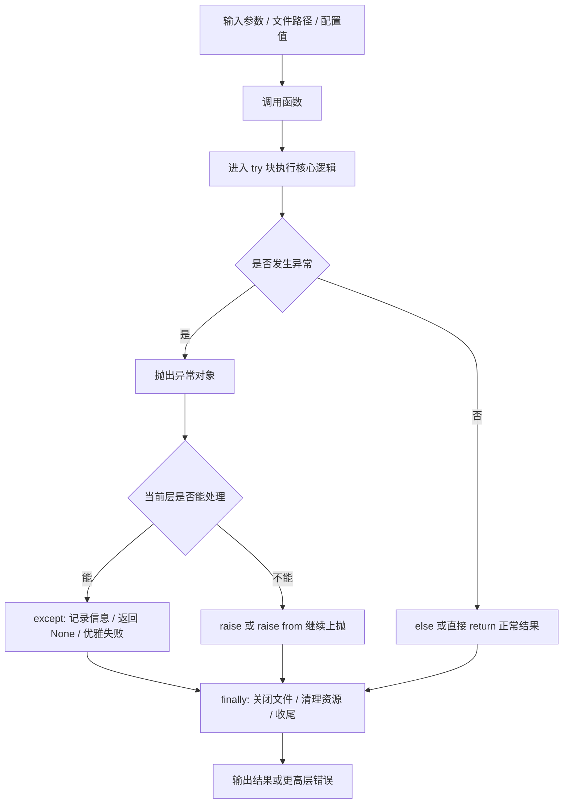

# Day 010 - 异常处理与调试

## 这一天在整条路线里的位置

- 代码运行时为什么会失败
- 错误应该在哪里被接住
- 什么情况下应该返回默认结果，什么情况下应该继续抛错
- 怎样让错误信息更利于定位和调试

所以 Day 010 的核心不是背几个语法块，而是开始理解“运行时错误处理”这件事。

## 用自己的一句话解释今天的主题

`异常处理与调试` 解决的是：程序运行过程中出错时，怎样让错误被发现、传播、拦截、定位，以及在可能时恢复或优雅失败。

## 它和昨天的 typing / 函数签名是什么关系

我现在把它们理解成两层不同的问题：

- `typing 与函数签名`：提前说明函数应该怎么被调用
- `异常处理与调试`：程序真正跑起来以后，出了问题怎么办

也就是说：

- `typing` 更像接口说明书
- 异常处理更像运行时故障管理

这两者是互补关系，不是谁替代谁。

## 什么是异常

我目前对异常的理解是：

异常是 Python 用来表达“程序没有沿着正常路径继续执行”的机制。

比如这些情况都会触发异常：

- 除以零
- 把 `"hello"` 转成整数
- 打开一个不存在的文件
- 配置值类型不对

所以异常不是“普通返回值的一种写法”，而是在说：

`这里发生了一个正常逻辑之外的问题。`

## try / except / else / finally / raise 分别在做什么

### 1. try

`try` 里放的是“可能出错的代码”。

它的重点不是把整段函数都塞进去，而是尽量只包住真正可能失败的部分。

### 2. except

`except` 的作用是：如果发生了某种异常，就在这里处理。

比如：

- 遇到 `ZeroDivisionError`，返回 `None`
- 遇到 `ValueError`，打印提示信息
- 遇到文件不存在，给调用方一个更清楚的错误说明

所以 `except` 是“接住错误并决定下一步怎么办”。

### 3. else

`else` 只有在 `try` 没有发生异常时才会执行。

它的意义是把“成功路径”单独拿出来，让 `try` 块更聚焦于真正可能失败的代码。

我现在记它的方式是：

- `except` 处理失败
- `else` 处理成功

### 4. finally

`finally` 不管有没有异常，最后都会执行。

它常用于：

- 关闭文件
- 释放锁
- 清理临时资源
- 输出“本次处理结束”的收尾信息

所以 `finally` 的重点不是业务逻辑，而是收尾。

### 5. raise

`raise` 的作用是主动抛出异常。

它适合用在：

- 参数校验失败
- 当前层无法恢复
- 需要明确告诉调用方“这个输入或状态不合法”

所以 `raise` 不是被动等 Python 报错，而是主动声明：

`这个地方不能按正常路径继续执行。`

## 今天这些例子分别在说明什么

结合 `test/day010.py`，我觉得今天真正要掌握的是这 7 个点：

### 1. 基本 try-except

`safe_divide` 和 `safe_convert` 说明：

- `try` 放可能出错的代码
- `except` 接住具体异常
- 当前层如果知道怎么兜底，可以把异常转成 `None` 之类的可处理结果

这类写法适合“当前层已经知道怎样降级或优雅失败”。

### 2. 多个异常类型

`safe_list_get` 和 `safe_divide_any` 说明：

- 一个操作可能有多种失败方式
- 可以用一个 `except (A, B)` 一起捕获
- 也可以写多个 `except` 区分处理逻辑

这部分提醒我：异常处理不是只问“会不会错”，还要问“会以哪几种方式错”。

### 3. else 子句

`divide_with_else` 和 `read_file_safe` 说明：

- `else` 只在没有异常时执行
- 它能把成功路径从 `try` 中拆出来
- 这样代码更容易看清“哪里是风险点，哪里是成功处理”

### 4. finally 子句

`divide_with_finally` 和文件操作例子说明：

- 无论成功还是失败，`finally` 都会运行
- 它很适合资源清理

这部分非常像真实工程代码，因为很多问题不是“算错了”，而是“资源没收干净”。

### 5. raise 抛出异常

`set_age` 说明：

- 有些错误不应该在当前层偷偷吞掉
- 如果输入本身不合法，应该直接 `raise`
- 这样调用方才知道自己传错了，而不是误以为程序正常工作

所以：

- 能恢复、能降级时，可以考虑 `except`
- 不能恢复、违反接口约束时，更适合 `raise`

### 6. 自定义异常

`InsufficientBalanceError` 和 `InvalidConfigError` 说明：

- 工程代码里的错误不只是“报一段字符串”
- 更重要的是让调用方能按错误类型做决策
- 还可以把关键上下文一起带出去

比如余额不足时，不只是知道失败了，还知道：

- 当前余额是多少
- 需要的金额是多少

这比只抛一个普通 `ValueError("余额不足")` 更利于业务处理和调试。

### 7. 异常链

`raise ... from ...` 说明：

- 高层错误和底层错误可以同时保留
- 对外可以给更容易理解的业务级错误
- 对内又不会丢掉真实的底层原因

比如：

- 高层看到的是“配置文件加载失败”
- 调试时还能继续查到“原始原因是文件不存在”或者“JSON 格式错误”

## safe_convert 和 set_age 这两个例子最能说明什么

我现在觉得这两个例子特别重要，因为它们正好代表两种常见思路：

### safe_convert

这类函数是在当前层把错误消化掉，然后返回一个可继续处理的结果，比如 `None`。

它适合：

- 当前层知道怎么处理失败
- 失败是预期内情况
- 调用方不需要看到完整异常，只需要知道“这次没有成功”

### set_age

这类函数是在当前层主动拒绝非法输入，把错误抛给调用方决定怎么处理。

它适合：

- 输入违反了接口约束
- 当前层无法恢复
- 需要让上层明确知道调用方式不合法

这也让我更清楚地看到：

- 不是所有失败都该 `except`
- 也不是所有问题都该直接 `raise`
- 关键在于当前层是否真的有能力处理这个问题

## 今天最重要的结论

今天最重要的不是记住异常名称，而是建立这几个判断：

1. `typing` 负责接口表达，异常处理负责运行时错误管理。
2. 不是所有异常都应该立刻吞掉，关键要看当前层能不能真正处理。
3. `else` 用来分离成功路径，`finally` 用来保证收尾动作执行。
4. 自定义异常和异常链会让工程代码更容易排查和协作。

## 它和模型工程主线的关系

这和后面做模型、训练脚本、推理脚本、agent 工具封装的关系很直接：

- 数据文件路径写错，会报文件异常
- 配置格式不对，会报解析异常
- 参数值非法，需要主动 `raise`
- 下游工具失败时，要么包装成更高层错误，要么记录日志后继续上抛

如果不会处理异常，程序一旦失败，就很容易出现两种糟糕情况：

- 直接崩掉，但看不出问题在哪
- 错误被吞掉，结果后面带着脏状态继续跑

所以异常处理不是“补丁”，而是工程稳定性的一部分。

## 今天最容易出现的误区

- 误区 1：写了类型注解，Python 就会自动在运行时拦住错误。
  实际上 `typing` 主要是给人和工具看的，不会自动替代异常处理。
- 误区 2：所有错误都应该在当前层 `except` 掉。
  实际上如果当前层不能真正恢复，吞掉错误只会让排查更难。
- 误区 3：自定义异常只是把报错名字改得更花哨。
  实际上它的价值在于表达业务语义和携带上下文。
- 误区 4：`raise ... from ...` 只是语法细节。
  实际上它对调试很重要，因为能保留底层异常链。

## 3 个判断题

1. 只要写了类型注解，Python 默认就会在运行时自动阻止类型错误。  
   `False`
2. `finally` 不管有没有异常，最后都会执行。  
   `True`
3. `raise ... from ...` 的作用之一，是在抛出高层错误时保留底层原始原因。  
   `True`

## 如果现在让我不用资料解释今天在学什么

我会这样说：

今天学的是 `异常处理与调试`。它解决的不是“函数接口怎么写清楚”，而是“代码真正跑起来以后出了错怎么办”。`try/except` 用来接住并处理错误，`else` 用来表达成功路径，`finally` 用来做收尾清理，`raise` 用来主动拒绝非法状态。再往上一步，自定义异常是在表达业务语义，异常链是在保留底层原因，方便调试和排查。

## 给下一个 AI 的交接

- Day 010 的核心已经不是继续扩展知识面，而是确认是否真的理解了 `typing` 和异常处理的边界。
- 当前应重点检查用户能否用自己的话解释：什么问题属于接口表达，什么问题属于运行时错误处理。
- 如果用户已经能顺着讲清 `try / except / else / finally / raise`、自定义异常、异常链，以及 `safe_convert` 和 `set_age` 两种思路的差别，那么 Day 010 可以视为基本完成，下一步可以进入 Day 011 的工程与系统视角。

## 输入 -> 中间过程 -> 输出 / 报错 图

