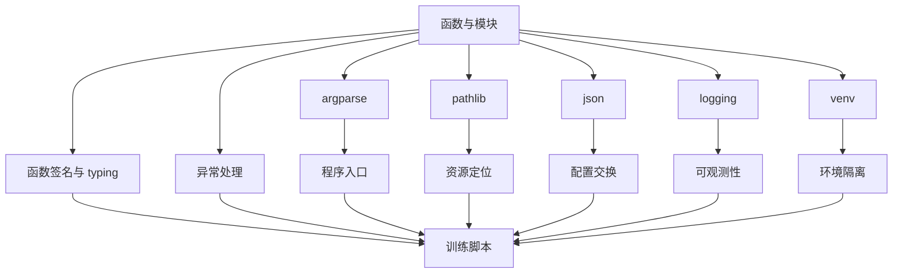

# Day 013 - Week 02 结构化整合笔记

## 本周主题

Python 工程基础

## 用自己的一句话解释本周主题

Week 02 解决的是：把“能跑的 Python 代码”继续推进成“接口清楚、出错可排查、资源能定位、配置可复现、运行可观察”的真实工程脚本。

## 定义：这一周到底在学什么

如果说 Week 01 更像是在认识 Python 程序的基本骨架，那么 Week 02 就是在补这套骨架的工程层。

它主要回答 5 个问题：

1. 函数接口怎么表达清楚
2. 程序运行时报错怎么办
3. 路径和资源怎么稳定管理
4. 配置怎么传递、保存和复现
5. 运行过程怎么留下可排查的线索

所以这周内容不是几个零散库函数，而是在补一个真实脚本最小可维护结构。

## 作用：这些知识分别在系统里干什么

我现在把 Week 02 的内容拆成 3 层：

### 1. 接口表达层

这一层主要是：

- `typing`
- 函数签名

它解决的是：

- 一个函数应该怎么被调用
- 输入输出边界如何描述
- 人和工具怎样更容易理解接口

### 2. 运行时故障处理层

这一层主要是：

- `try / except / else / finally / raise`
- 自定义异常
- 异常链

它解决的是：

- 程序失败时怎样被发现
- 错误应该在哪里被接住
- 当前层应该兜底还是继续上抛

### 3. 工程骨架层

这一层主要是：

- `pathlib`
- `json`
- `argparse`
- `logging`
- `venv`

它解决的是：

- 程序从哪里启动
- 程序去哪里找资源
- 配置怎样脱离硬编码
- 运行时怎样留下日志
- 环境依赖怎样隔离

## 上下游关系：这周知识是怎么串起来的

我现在对这一周的串联方式是：

1. 先用函数和模块把逻辑拆开。
2. 再用函数签名和 `typing` 把接口写清楚。
3. 用异常处理决定失败时是恢复、终止，还是继续上抛。
4. 用 `argparse` 接收程序入口参数。
5. 用 `pathlib` 定位配置、数据、权重、输出目录。
6. 用 `json` 或其他结构化格式保存配置和结果。
7. 用 `logging` 记录关键运行状态和错误线索。
8. 用 `venv` 隔离环境，避免“同样代码换环境就跑不起来”。

所以它们不是彼此独立的主题，而是在一起回答一个问题：

`一个训练脚本、推理脚本或工具脚本，怎样从“临时能跑”变成“能复现、能维护、能交接”？`

## 《训练脚本为什么必须有配置和日志》

### 先说结论

训练脚本不是简单运行一次就结束的小 demo，而是一个需要反复试验、反复比较、反复回头检查的工程入口。

如果没有配置和日志，训练脚本很容易出现两类致命问题：

1. 这次到底是怎么跑出来的，事后说不清
2. 这次为什么失败了，事后查不到

所以配置和日志不是“锦上添花”，而是训练脚本最小工程骨架的一部分。

### 为什么必须有配置

配置的本质，是把影响结果的关键参数从代码里抽离出来，变成可查看、可保存、可比较的结构化信息。

训练脚本里最常见的配置包括：

- 数据路径
- 模型超参数
- batch size
- 学习率
- epoch 数
- 输出目录
- 随机种子

如果没有配置，常见问题会是：

- 参数散落在代码里，不知道这次改了什么
- 几天后无法复现当时的结果
- 不同实验之间难以稳定比较
- agent 或自动化脚本很难批量调用

所以配置解决的不是“书写方便”，而是复现性、可比较性和自动化能力。

### 为什么必须有日志

日志的本质，是把运行过程里的关键状态、告警和错误留下来，变成可回看、可追踪的线索。

训练脚本里最常记录的日志包括：

- 任务开始时的配置摘要
- 当前 epoch / step
- loss 或评测指标变化
- 数据或路径异常
- checkpoint 保存位置
- 异常堆栈和失败原因

如果没有日志，常见问题会是：

- 不知道训练跑到哪一步停了
- 不知道是路径错、配置错，还是数据错
- 只能靠 `print` 零散猜测
- 事后无法快速给下一个 AI 或下一个自己交接

所以日志解决的不是“把字打印出来”，而是可观测性和排障效率。

### 配置和日志在训练脚本里的协作关系

我现在把训练脚本理解成这样的流程：

1. 程序入口接收参数
2. 读取配置
3. 定位数据、权重、输出目录
4. 开始训练
5. 周期性记录关键状态
6. 失败时记录异常信息
7. 成功时保存结果与 checkpoint

这意味着：

- 配置决定“这次要怎么跑”
- 日志决定“这次实际上发生了什么”

一个负责定义实验，一个负责留下过程。

没有配置，实验不可复现；没有日志，失败不可追踪。

### 它和主线的关系

这页笔记和后面的模型工程主线关系非常直接：

- 自己训练小模型时，需要稳定管理超参数和输出目录
- 做推理服务时，需要记录请求、错误、耗时和模型版本
- 接 agent / MCP 时，需要给工具调用留下结构化输入输出和错误线索
- 阅读开源模型项目时，几乎都会看到配置系统和日志系统

所以今天这页内容不是“脚手架知识”，而是后面所有实战都会反复遇到的系统基础。

## 常见误区

### 误区 1：这些只是 Python 小工具，不算核心知识

实际上一旦代码从几个函数变成真实脚本，最常见的故障恰恰就出在路径、配置、入口和日志上。

### 误区 2：写了 `typing` 就不需要异常处理

`typing` 解决的是接口表达，异常处理解决的是运行时失败，它们是两层不同的问题。

### 误区 3：日志就是高级一点的 `print`

日志的真正价值不是打印，而是分级、格式化、落盘、检索和排障。

### 误区 4：先把代码写出来，后面再补配置和日志

如果一开始就把参数写死、日志缺失，后面项目一变复杂，返工成本会很高。

## 我目前还没完全解决的问题

1. `typing` 里更复杂的泛型、协议和类型变量，什么时候值得引入，什么时候会徒增阅读负担。
2. `logging` 在稍大项目里怎样设计模块级 logger、handler 和 formatter，才能既统一又不混乱。
3. 配置系统在项目继续变大后，什么时候应该从简单 `json` 升级到更完整的配置管理方案。

## 我现在已经理解了什么

1. Week 02 的重点不是库函数本身，而是工程骨架。
2. `typing` 负责接口表达，异常处理负责运行时故障管理。
3. `pathlib / json / argparse / logging / venv` 共同决定一个脚本是否可复现、可移植、可调试。
4. 配置和日志是训练脚本的必需品，不是附加项。

## 给下一个 AI 的交接

- Week 02 已经推进到整合表达阶段，用户不再需要逐个模块从零讲起。
- 当前更需要的是 Week 02 总复盘：哪些真的掌握了，哪些还只是“看过”。
- Day 014 应重点帮助用户完成一页周总结，明确“我已经理解了什么、我还不会什么、下周最大风险是什么”，并列出最模糊的 3 个问题。

## Week 02 结构图

