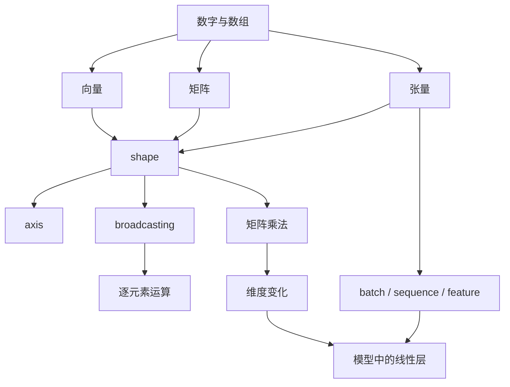

# Day 015 - Week 03 学习地图

## 这周在整条路线里的位置

Week 03 还处在阶段 1 的基础层，但学习重心已经从“Python 工程怎么组织”切到“模型代码里的数据怎么表示和计算”。

如果说：

- Week 01 解决的是 Python 程序怎么运行
- Week 02 解决的是 Python 工程怎么组织

那么 Week 03 要解决的是：

- 模型里的数据为什么经常以向量、矩阵、张量的形式出现
- `shape` 为什么如此重要
- 广播和矩阵乘法为什么会决定一段代码能不能正确运行

所以，这一周的重点不是成为线性代数考试型选手，而是建立“模型代码里的数据结构和维度变化直觉”。

## 用自己的一句话解释 Week 03

线性代数与 NumPy，解决的是：让我能从“数字堆在一起”升级到“我知道这些数字在张量里是怎么排布、怎么对齐、怎么经过运算发生形状变化”的理解。

## 本周关键概念总览

### 1. 向量、矩阵、张量

- 关注点：数据不是一团散乱数字，而是按维度组织起来的结构。
- 作用：帮助我理解模型中的输入、批次、特征、权重和输出到底在以什么形态存在。
- 和主线的关系：Embedding、激活值、batch、权重矩阵、logits，本质上都可以理解成不同 shape 的张量。

### 2. shape 和 broadcasting

- 关注点：一个数组每一维有多大，不同 shape 之间怎样对齐运算。
- 作用：帮助我判断两个张量能不能相加、相乘，广播发生时到底补了哪一维。
- 和主线的关系：后面读 NumPy、PyTorch、Transformer 代码时，很多 bug 不是公式错，而是 shape 不匹配。

### 3. 矩阵乘法与维度变化

- 关注点：一次乘法之后，维度为什么会变，哪些维会被消掉，哪些维会保留下来。
- 作用：帮助我建立“线性变换”和“特征混合”的第一层直觉。
- 和主线的关系：神经网络中的线性层、注意力里的 QK 计算、投影层，本质上都离不开矩阵乘法。

## 这周概念怎么串起来

我现在对 Week 03 的理解是：

1. 先知道数据可以被组织成向量、矩阵和更高维张量。
2. 再用 `shape` 去描述这些结构每一维的大小。
3. 接着理解广播为什么允许某些不同 shape 的张量一起运算。
4. 然后理解矩阵乘法如何让一个张量经过变换后变成另一个 shape。
5. 最后把这些直觉迁移到模型代码里，知道输入、权重、隐藏状态和输出是怎样流动的。

所以这周不是在学孤立的数学术语，而是在建立“数据形状与运算如何驱动模型计算”的最小心智模型。

## 和模型工程主线的关系

Week 03 和后面的主线关系非常直接：

- 自己写小模型时，要先能看懂 batch、sequence length、feature dimension 是什么意思
- 读开源模型代码时，要能看懂一层线性变换前后 shape 为什么会变
- 读注意力机制时，要能跟住张量维度的重排和矩阵乘法
- 做调试时，很多最先暴露的问题其实是 shape 不匹配，而不是算法思想本身

所以这一周本质上是在补“我能读懂张量世界里的数据流”的基础。

## 我预计这周最值得重点关注的地方

如果我已经有编程基础，那么这一周最需要警惕的不是 NumPy 语法，而是以下 3 个误区：

- 误把“向量 / 矩阵 / 张量”当成纯数学名词，而不把它们和程序里的数组对象对应起来。
- 只记 `reshape`、`transpose`、`dot` 这些操作名字，却不追踪维度为什么变化。
- 看广播时只觉得“代码居然能跑”，但不知道补齐的是哪一维、为什么能对齐。

所以这周最值得重点关注的，不是函数名，而是 `shape` 直觉和维度流动。

## 当前最陌生的 3 个术语

1. `axis`
2. `broadcasting`
3. `ndarray`

## 这周我会怎么学

1. 先把“向量、矩阵、张量”这组词讲清楚，不急着上复杂公式。
2. 再重点建立 `shape` 的阅读习惯，看到数组先看维度。
3. 接着理解广播：什么时候自动扩展是合法的，什么时候会报错。
4. 最后再进入矩阵乘法，把“输入 shape -> 运算 -> 输出 shape”讲清楚。

## 给下一个 AI 的交接

- Week 03 已开始，当前目标不是马上推很多线代公式，而是建立全局地图。
- 用户已经完成了 Week 02 的工程视角训练，因此这周更适合强调“数据结构和维度流动”而不是抽象数学推导。
- Day 016 应优先讲清 `向量、矩阵、张量` 的定义、输入输出、作用场景，以及它们和 `numpy.ndarray`、shape、模型数据流之间的关系。

## Week 03 概念关系图

